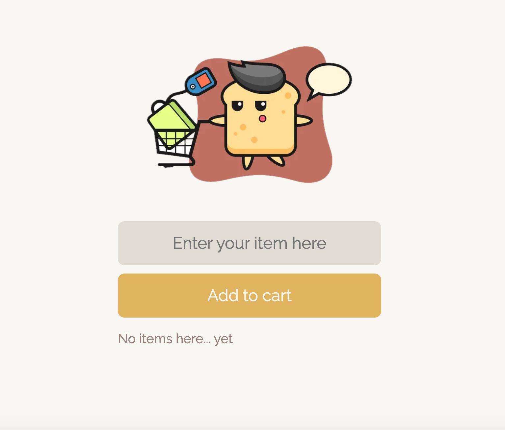

# Shopping List Mobile React App

## Table of contents

- [Overview](#overview)
  - [Screenshot](#screenshot)
  - [Links](#links)
- [My process](#my-process)
  - [Built with](#built-with)
  - [What I learned](#what-i-learned)

## Overview

This project is a mobile application designed to simplify shopping list management with a user-friendly interface. Users can interact with their list dynamically; each item can be instantly removed with a click. Leveraging Firebase for real-time data storage and synchronization aims to streamline online shopping list organization for users.

### Screenshot

### Links

- Live Site URL: [https://shopping-list-mobile-react-app.vercel.app/]

## My process

### Built with

- React
- CSS
- Javascript
- Firebase

### What I learned

- **Firebase Usage:** Learned to use Firebase for real-time data storage and synchronization, ensuring seamless updates as items are added or removed. Specifically, gained experience with Firebase functions like `initializeApp`, `getDatabase`, `ref`, `push`, `onValue`, and `remove`.

- **Vite for React:** Migrated the project from a traditional setup to a Vite-based React application, resulting in faster development builds and a more efficient development environment. Learned how to configure Vite, handle asset management, and utilize Vite's optimized development server.

- **React Component Structure:** Converted vanilla JavaScript code into React functional components, leveraging hooks like useState and useEffect for state management and side effects. Improved understanding of component-based architecture and state-driven UI updates.

- **Favicon Integration:** Added custom favicons to improve the visual appeal of the web application. This also enhances the user experience by providing a recognizable icon in the browser tab, bookmarks, and other places where the web application is referenced.
